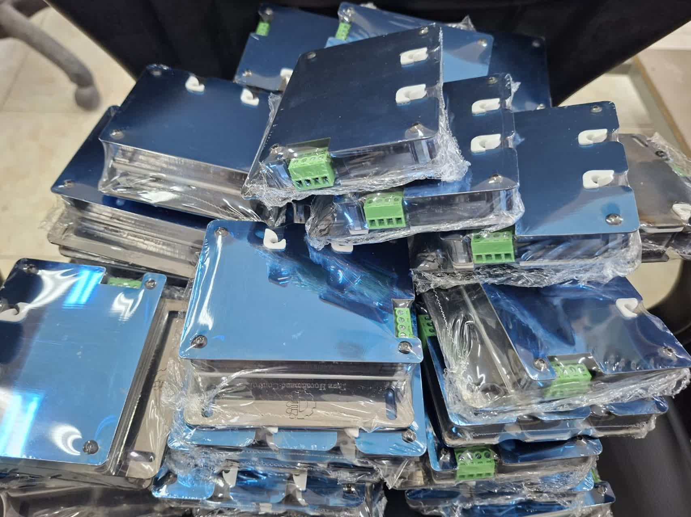
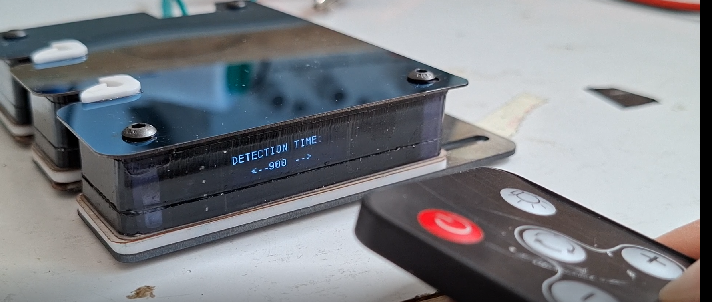

# PORTFOLIO

# Embedded Systems & R&D Engineering Portfolio

Embedded Systems & R&D Engineer specializing in industrial automation, intelligent sensing, embedded firmware, control systems, and product development.

This portfolio showcases selected industrial projects, including embedded firmware, mechanical design, and control engineering.
This repository presents selected projects in embedded systems, intelligent control, robotics, and industrial automation. Detailed implementations are organized in dedicated repositories.

Featured Industrial Products
1. Yarn Detect Smart Sensor 
2. Industrial Color Mixing Machine 
3. Networked Control Systems (MATLAB)

                             Industrial Yarn Detect Smart Sensor

Developed an industrial optical sensing system for textile machinery featuring adaptive signal processing, high-speed STM32 firmware, and custom mechanical design.

 Description:
• Real-time optical yarn detection system
• Developed for industrial textile machines 

Embedded Features:
• STM32G0/G4 firmware 
• Adaptive signal processing 
• CAN communication
• NRF24 wireless controller
•Timer-triggered sampling
•ADC, DMA, Timers, PWM
•WS2812 LED control
•IR communication
•UART/I2C/SPI interfaces
•Industrial prototype development

links to Firmware Repositories:

[12-Channel Yarn Detection Sensor_firmware](https://github.com/darasmartcontrol/STM32_12Channel_Yarn_Detection_Optical-Sensor)

[Prototype Detection Sensor_firmware](https://github.com/darasmartcontrol/STM32_REAL_TIME_Prototype_Detection_Optical_Sensor)

[CAN Bus Yarn Sensor_firmware](https://github.com/darasmartcontrol/Stm32_Yarn_Sensor_CANBus)

links to Hardware Repositories:

[12-Channel Yarn Detection Sensor_Hardware](https://github.com/darasmartcontrol/Hardware-Mechanical-Design/tree/main/12%20channel_optic_yarn%20detect%20sensor)

[6-Channel Yarn Detection Sensor_Hardware](https://github.com/darasmartcontrol/Hardware-Mechanical-Design/tree/main/6%20channel_optic_yarn%20detect%20sensor)

[2-Channel Yarn Detection Sensor_Hardware](https://github.com/darasmartcontrol/Hardware-Mechanical-Design/tree/main/2_channel_sensor))

[Prototype Detection Sensor_Hardware](https://github.com/darasmartcontrol/Hardware-Mechanical-Design/tree/main/prototype_detection_textile_sensor)

                             Industrial Textile Dye Mixing Machine
                                          
Embedded firmware for an industrial textile color mixing machine implementing PID temperature control, user-defined temperature profiles, custom serial communication with HMI, and real-time process management.

Features:

• PID temperature controller 

• User-defined temperature-time profiles 

• Piecewise linear trajectory generation 

• Automatic calibration mode 

• Future reference prediction 

• Heater TRIAC phase-angle control 

• Cooling fan control 

• Custom serial communication protocol 

• HMI integration 

• Progress indication using NeoPixels 

• Process logging 

• Automatic shutdown 

Hardware:

•STM32G431 

•TRIAC heater 

•Thermistor 

•Cooling fan 

•NeoPixels 

•HMI tablet 

Algorithms:

•Median filtering 

•Piecewise linear interpolation 

•Adaptive calibration 

•PID controller 

•State machine

Link to hardware repository:

[Industrial Color Mixing Machine Design](https://github.com/darasmartcontrol/Hardware-Mechanical-Design/tree/main/Color_maker)

link to embedded software  repository:

[Industrial Color Mixing Machine firmware](https://github.com/darasmartcontrol/Industrial-Color-Mixing-Machine)

                            wireless robot controller
                                                      
 Description:
 
two STM32 microcontrollers and an nRF24L01 transceiver.

Hardware:

Transmitter (STM32G030K6T6)

The handheld transmitter includes:

• Dual analog joysticks (4 ADC channels)

• 4 push buttons

• Battery voltage monitoring

• WS2812 NeoPixel status LEDs (Timer + DMA)

• Buzzer

• nRF24L01 wireless module (SPI)

The receiver STM32G030C8T6 side:

• Four DC motors using PWM

• Two servo motors

• nRF24L01 wireless communication

Features:

• STM32 HAL drivers

• DMA-based ADC acquisition

• DMA-driven WS2812 LED driver

• SPI communication with nRF24L01

• Automatic ACK handling

• Dynamic payload support

• Random address binding

• Flash memory storage of binding information

• Battery monitoring

• Wireless joystick control

• Four DC motor outputs

• Two servo outputs

link to Firmware Repository:

[NRF24 Robot Controller](https://github.com/darasmartcontrol/STM32_NRF24_Robot_Controller)

                         Networked Control Systems
                                             
Implementations of Model Predictive Control (MPC), Fuzzy Control, event-triggered control, networked control systems, multi-agent systems, communication scheduling, Hybrid Petri Nets, and optimization techniques using YALMIP and TOMLAB.

• MATLAB/Simulink simulations 

• Model Predictive Control (MPC) 

• Event-triggered communication 

• Optimization using YALMIP/TOMLAB 

Repository:

[MATLAB-Control-Engineering](https://github.com/darasmartcontrol/MATLAB)

-----------------------------------------
                                            

